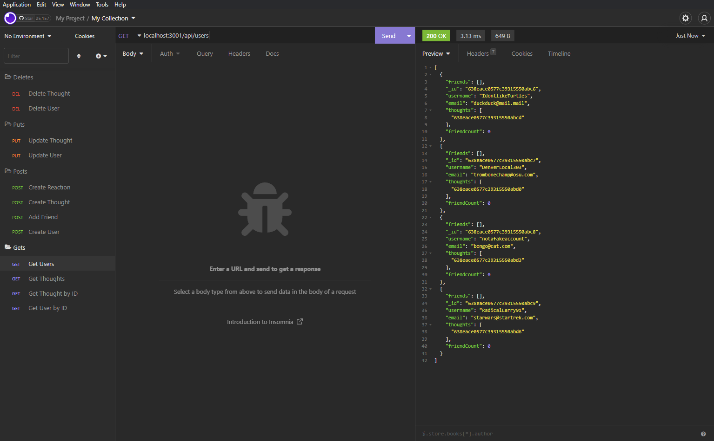
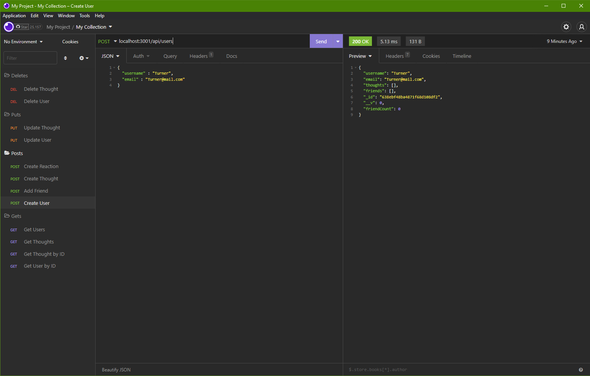

# ***Talk to People***

>An API designed to help an up and coming social media site handle large amounts of unstructured data with a NoSQL database. Talk to People allows users to create an account, add friends, do some thinking, and react to other's thoughts! Check out the video demo on how this all works.

[Video Demo](https://drive.google.com/file/d/1UBmBrbQ9q9ERfEzoG5AQzh4dqtQMWU85/view)

## How it Works

Through this API there are Users, Thoughts, and Reactions. A user can sign up with an email and then be able to post Thoughts and Reactions to Thoughts. Users can also add other users as friends. 

There is no front-end to this API, but using a tool like [Insomnia](https://insomnia.rest/) you can see for yourself that all the routes/controllers work.

## Screenshots

### Tools

Here's the tools I used in this project:

- [Insomnia](https://insomnia.rest/) For testing routes
- [Node.js](https://nodejs.org/en/) For working in terminal
- [MongoDB](https://www.mongodb.com/) For data storage
- [Mongoose](https://mongoosejs.com/) For object mapping and connecting to MongoDB